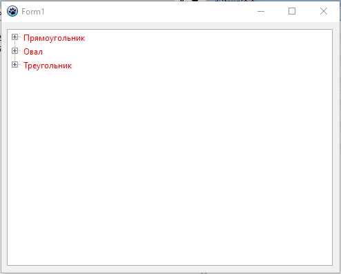
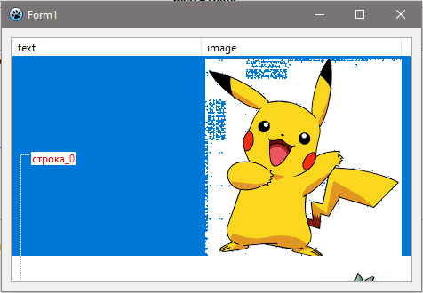
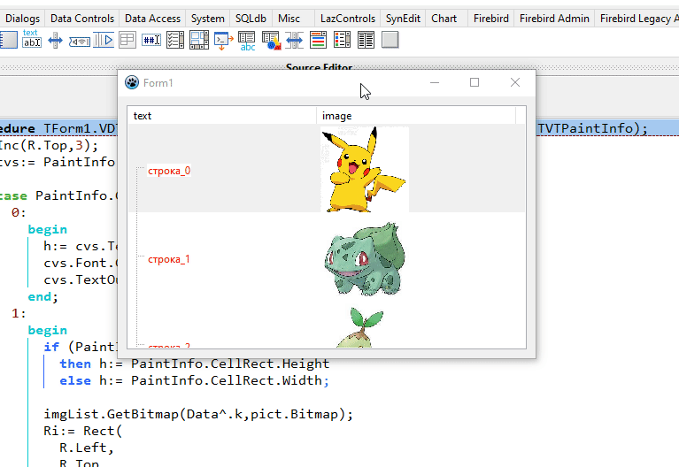

# laz_virtualDrawTree

Test project with various examples of using VirtualDrawTree

0.0.1
- add simple example 1 (draw shapes) + [russian artical](manual/01/VDT.html) about DrawTree OnDraw method

0.0.2
- add simple example 2 (canvas.Draw method draws a picture)

0.0.3
- add simple example 3 (canvas.StretchDraw method draws a picture)

